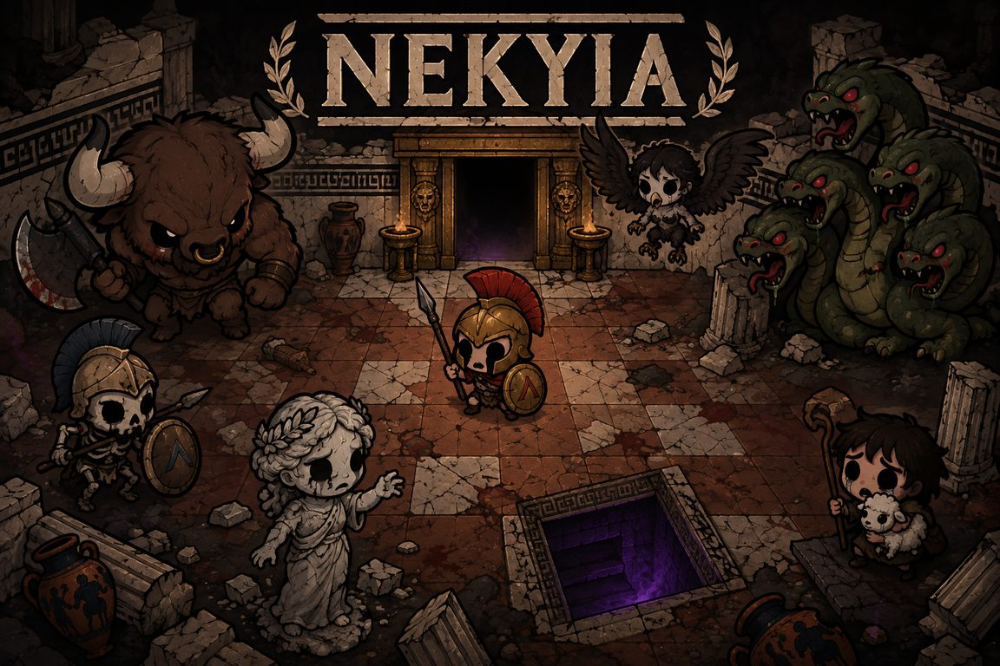

# Nekyia — art direction & asset pipeline

## The look in one line

*The Binding of Isaac* proportions and grime, painted with the palette of a
Greek black-figure vase: terracotta, cream marble, bronze gold, near-black —
plus one accent colour per thing (red plume, green venom, purple underworld).

## Rules (apply to every new sprite)

| Rule | Why |
|---|---|
| Chibi: huge round head, stubby body, big sad/angry eyes | Isaac silhouette; readable at ~50 px |
| Thick dark-brown outline (never pure black), flat cel shading, one shadow tone | Everything reads as one set |
| Palette: terracotta `#c4632a`, cream `#e8dcc0`, bronze `#c9a45c`, near-black `#1a1410`, marble `#d8d0c0` | Black-figure pottery mood |
| One accent colour max per sprite | Keeps rooms calm; the accent is the "tell" (Kratos red stripe, Hydra green) |
| Front-facing, full body, centred, ~85 % of the frame | The processing script trims and fits automatically |
| Rooms are low-contrast and desaturated; characters are saturated | Sprites pop on the floor (see `tone` in `scripts/art/process.py`) |
| Greek motifs everywhere: meander (Greek key) bands, Doric columns, laurel, owl coin | Theme without words |

## Texture keys and sizes

The code only ever asks for **texture keys**. `BootScene` loads
`public/art/<key>.png` for every key and draws a flat placeholder shape for
any key that has no file, so new content is always playable.

Sprites are exported at **2× their on-screen size** (`ART_SCALE` in
`src/art/manifest.ts`) and drawn with `setScale(1 / ART_SCALE)`, so they stay
crisp when the 960×576 canvas is scaled up. Room tiles are 1:1. Sizes below
are on-screen; the PNG is twice that where marked ×2.

| Key | On-screen (px) | Used by |
|---|---|---|
| `player_<character.id>` | 56×56 ×2 | in-room hero (physics circle r=20 centred) |
| `portrait_<character.id>` | 96×96 ×2 | menu (falls back to `player_*` at 2×) |
| `enemy_<enemy.id>` | `radius*2+16` square ×2 | `Enemy` (physics circle centred) |
| `item_<item.id>` | 28×28 ×2 | HUD, pedestal, game-over |
| `floor` `floor_1..3` | 64×64 | floor variants mixed per cell (quadrants of one source) |
| `wall` `pit` `door_open` `door_closed` | 64×64 | room tiles; `floor*`/`wall` are tinted by `stage.palette` (keep them light and neutral) |
| `rock` `pedestal` `trapdoor` | 64×64 (transparent) | room props |
| `heart_full` `heart_half` `heart_empty` `pickup_heart` | 26×24 ×2 | HUD / drop |
| `pickup_coin` | 22×22 ×2 | drop |
| `menu_bg` (`.jpg`) | 960×576 | menu background, cropped from the key art |

Generated at boot (no file): `shadow` (soft ellipse under every actor) and
`vignette` (room-sized darkening towards the walls). Actors bob while moving,
squash on hit; behaviours request extra stretch via `Enemy.stretch`.

Doors are authored for the **top** wall (doorway opening down into the room);
`RunScene` rotates them for left/right and mirrors for the bottom wall.

## Pipeline: prompt → 1024² source → game PNG

1. Generate a 1024×1024 source on a **flat pure magenta `#FF00FF` background**
   (characters/props) or a full-frame **seamless tile** (floor/wall/doors).
   Prompt skeleton that produced the current set:

   > A single video game character sprite for a top-down 2D roguelike in the
   > style of The Binding of Isaac: a chibi cartoon *{who, costume, weapon,
   > expression}*. Huge round head with a small stubby body, big expressive
   > eyes, thick dark brown outlines, flat cel shading with one shadow tone,
   > slightly grimy muted palette of terracotta, cream, bronze gold and
   > near-black, ancient Greek black-figure pottery mood. Front-facing, full
   > body, centered, filling about 85% of the frame. Background is a
   > completely flat solid pure magenta color (#FF00FF), no gradient, no
   > ground shadow, no text, no border, only one character.

   Enemies swap the first sentence for "a chunky cartoon *{monster}*, slightly
   creepy but cute"; items add "bold simple silhouette readable at small size".
2. Drop the file in a folder outside the repo (e.g. `~/art_raw/enemy_cyclops.png`;
   the file name is the texture key, except `heart` → `heart_*`/`pickup_heart`,
   `coin` → `pickup_coin`, `player_*` also feeds `portrait_*`).
3. `python3 scripts/art/process.py ~/art_raw enemy_cyclops` — chroma-keys the
   magenta, trims, fits into the size from `SIZES`, writes `public/art/enemy_cyclops.png`.
   Add the key to `SIZES` if it is new content (`radius*2+8` for enemies).
4. Commit only `public/art/*.png` (a few KB each). Sources are not versioned.

Needs `python3` with `pillow` and `numpy`.

## Backlog (art)

- Walk cycle / idle bob (2–3 frames) for players and chasers
- Hit flash is a tint today; add a squash + white flash sprite
- Per-stage floor/wall variants (Labyrinth: blue-grey stone, Underworld: black basalt + purple)
- Tears: replace the circles with small bronze arrowheads / spear tips per character
- NPC "!" talk bubble, shrine altar prop, boss health bar frame with meander
- Menu background: vase-painting frieze

## Reactive poses, facing and gods

Pose and facing variants are plain extra textures next to the base one; the
game falls back to the base texture whenever a variant is missing, so any
subset can be shipped.

| key | used when |
| --- | --- |
| `player_<id>_back` | hero moves/aims up |
| `player_<id>_side` | hero moves/aims left or right (flipped for left); the base sprite is the front view |
| `enemy_<id>_attack` | behaviour calls `enemy.attack(ms)`: contact range, firing, charge wind-up/charge |
| `enemy_<id>_hurt` | ~260 ms after `takeHit()` |
| `enemy_<id>_dead` | bosses only: collapse pose shown while the death flicker/fade plays |
| `god_<id>` | 160x160 portrait for the blessing overlay + 24px HUD icon (`src/data/gods.ts`) |

Prompts: same character sheet as the base sprite passed as a reference image,
plus the pose ("mid axe swing", "recoiling from a hit, eyes shut", "collapsed,
axe dropped", "seen from behind", "walking right, profile"). Sources go in a
second folder and are processed together:

    python3 scripts/art/process.py ~/art_raw ~/art_raw2

`BossIntroScene` (VS splash) reuses `portrait_<hero>` and the boss's base
sprite; `BlessingScene` uses `god_<id>`.

## Weapons, hits and telegraphs

- Every hero holds a signature weapon (`src/data/weapons.ts`): `weapon_<id>` is a
  64×64 sprite authored pointing right (the lyre upright). `Player.updateWeapon`
  places it in the hand of the current facing and plays a per-weapon swing on
  each shot: spear thrusts, bow draws, club smashes over the head, blades slash
  in an arc, lyre strums. Shots leave from the weapon's reach.
- Shots take the weapon's look (`shot_dart`, `shot_arrow`, `shot_boulder`,
  `shot_note`, `shot_blade`, drawn procedurally in BootScene): darts and arrows
  point along their flight, boulders and blades spin, notes wobble.
- `src/systems/fx.ts` holds the reactive feedback: `hitSpark` (flash + ring +
  sparks fanning back along the hit direction) on every shot landing and on the
  player being hurt, `dust` for footsteps and wall hits, `warnMark` + dust when a
  charger winds up, `speedLine` streaks while it charges, and a `shockwave` when
  it slams into a wall (`Enemy.chargeFx`).
- Heroes, enemies and weapons render at `ACTOR_SCALE` (1.2×) on top of the 2×
  art so they read big in the 13×7 room.

## Type

Cinzel (Trajan-style Roman capitals, `public/fonts/`) is the UI face; Cinzel
Decorative is used for the title and dialogue drop caps. Fonts are declared in
`index.html` and awaited in `main.ts` before Phaser boots, since Phaser
rasterises text to canvas.
